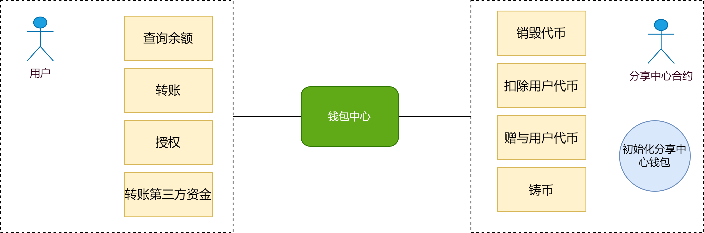
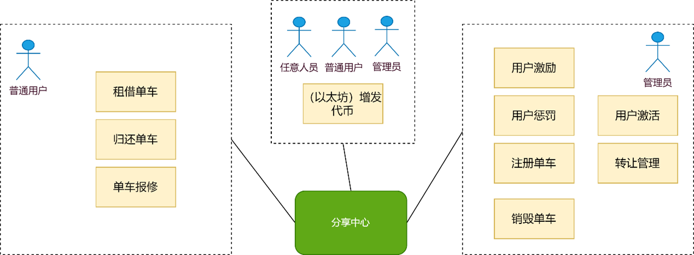

# 智能合约—单车分享

本次实验设置的智能合约为单车分享系统，构建一个去单车分享平台，该平台由三部分组成：分享中心，用户中心以及钱包中心。

分享中心由发起者进行创建，在分享中心创建的同时，会分别创建用户中心和钱包中心，值得注意的时，钱包中心会初始化发行一种代币，发行的数量根据支付的以太坊进行比例的换算，存储到分享中心的智能合约账户中，只有管理员才可以操作。

## 结构图

## 交互流程图

### 用户注册交互

### 分享中心交互

## 功能结构图
### 用户中心

### 钱包中心

### 分享中心

